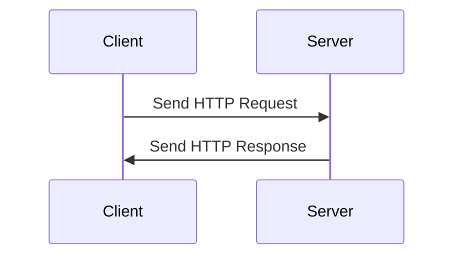

1. Realtime setting memungkinkan 2 sistem untuk berkomunikasi tanpa perlu refresh 
2. jadi konsepnya pakai websocket, garansi response time-nya
3. cepat berubahnya sesuai preferensi kita

Web ada client dan server, client kirim http request, server ngasi http response

Ingin ketika ada perubahan di server, maka di client ikut berubah, ada 4 strategi
1. Ajax
2. Long Polling
3. Server Sent Event
4. Web Socket

Use case notifikasi, tanpa perlu refresh halaman web
1. Ajax bisa digunakan, periodik setiap 5 detik melakukan ajax call untuk ambil notif
2. 
