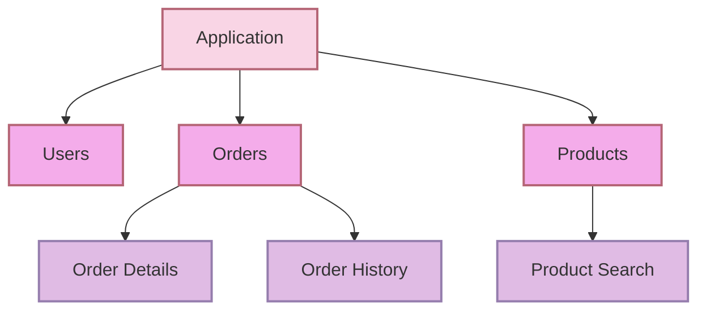

Konsep modular untuk membagi beberapa module, 1 module utama melakukan import beberapa modul dibawahnya, saat dibuat pertama kali, hanya ada 1 default module (App)

 <!-- Adjust the width as needed --> 
 <!-- Mermaid diagram code goes here --> 
 

  

Disini kita bisa memiliki <mark style="background: #FFF3A3A6;">1 root module (App) dan tinggal import beberapa modul dibawahnya</mark> saja, yang mana membuat manajemen filenya lebih enak dilihat, jadi tidak pakai layering

![[Pasted image 20240429115516.png|500]]
Disini kita bisa menentukan mau import modul apa saja, cara generate modul user bisa dilihat pada [[Commands]]