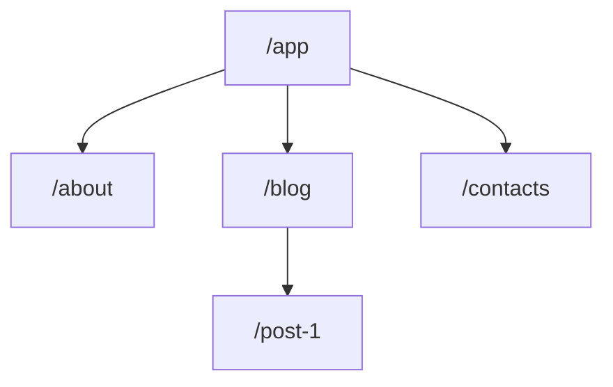

1. Next.js dibangung diatas react sebagai framework advancednya
2. Simplify building fullstack app with react
3. Bisa bulding highly interactive frontend yang easy blend with backend

## Benefit
1. Improved server-side rendering
2. Streaming responses
3. React Server Components
4. Server Actions

NextJS memudahkan kita untuk mengembangkannya, bisa dihandle otomatis sama dia
1. Bisa <mark style="background: #FFF3A3A6;">combine</mark> frontend sama backend di same project
2. <mark style="background: #FFF3A3A6;">Filesystem based routing</mark> ( sangat membantu )

3. <mark style="background: #FFF3A3A6;">Server side rendering</mark> -> dia pre render sebelum deploy terus dikirim ke client -> better SEO karena kontennya udah selesai tinggal dikirim

Server-side (backend) render page/html page di server kemudian dikirim ke client (frontend), nah disini beda dengan vanilla react yang dia ngasi 1 html file terus ngirim js js an yang nanti dirender di client -> <mark style="background: #FF5582A6;">berat di client</mark>

UI update terjadi pada client-side, dan halaman tidak berubah pada server -> nah ini bermasalah buat seo karena gada data yang diberikan -> makanya next js bisa kelihatan kontennya karena udah <mark style="background: #FFF3A3A6;">dirender</mark>

| **Pages Router**       | **App Router**                                      |
| ---------------------- | --------------------------------------------------- |
| Mature and very stable | relatively new (NextJS 13) sometimes buggy (future) |
| Feature Rich           | Support modern Next and React features              |
NextJS pakai [[Server Components]]

### Routing

Kalau kita ingin menambah routing vanilla react -> setting routing dll (cape), mending pakai app dir yang ada di NextJS
untuk about page -> maka bikin folder <mark style="background: #BBFABBA6;">about/page.js</mark> untuk route itu apabila ingin render halaman tersebut

Untuk navigasi antar page, kita bisa menggunakan <mark style="background: #FFF3A3A6;">Link</mark> agar tidak perlu render berkali2

Layout.js membungkus Page.js -> jadi perlu wajib ada 1 root layout js untuk sebagai dasar

> Hint : Bisa menggunakan @ untuk root seperti import "Header" from "@components/Header"

https://nextjs.org/docs/getting-started/project-structure
1. page.js -> new page
2. layout.js -> wrapper
3. not-found.js -> fallback not found
4. error.js -> fallback other error
5. loading.js -> fallback page loading fetch
6. route.js -> api route

##### Dynamic Route
Misalkan kita punya halaman products, kemudian pingin detail per produk, maka kita bisa menggunakan [details] pada routenya jadi /product -> <mark style="background: #FFF3A3A6;">/product/[productId]/page.js</mark>

##### Nested Layout
Ketika kita punya layout misalkan di @root kemudian kita pingin nambah layout spesifik folder tertentu, kita bisa bikin <mark style="background: #FFF3A3A6;">@foldername/layout.js</mark> kemudian dari situ dibenerin layoutnya

![[Pasted image 20240417055653.png|300]]

Untuk styling components, kita bikin /components.js sama /components.module.css terus diimport <mark style="background: #BBFABBA6;">import classes from "./main-header-background.module.css";</mark> kemudian classesnya digunakan di tiap classname, kalau gaada bisa pakai dict seperti dibawah

![[Pasted image 20240417061147.png | 300]]
